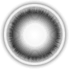
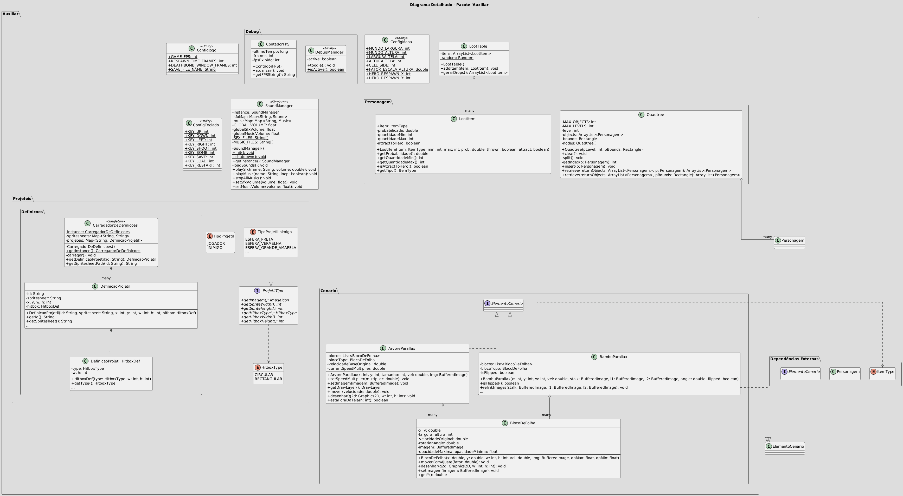
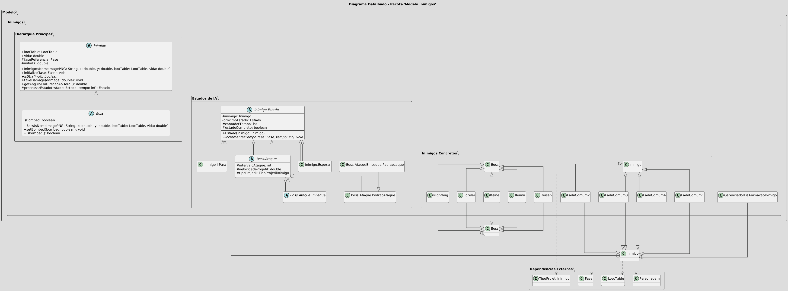
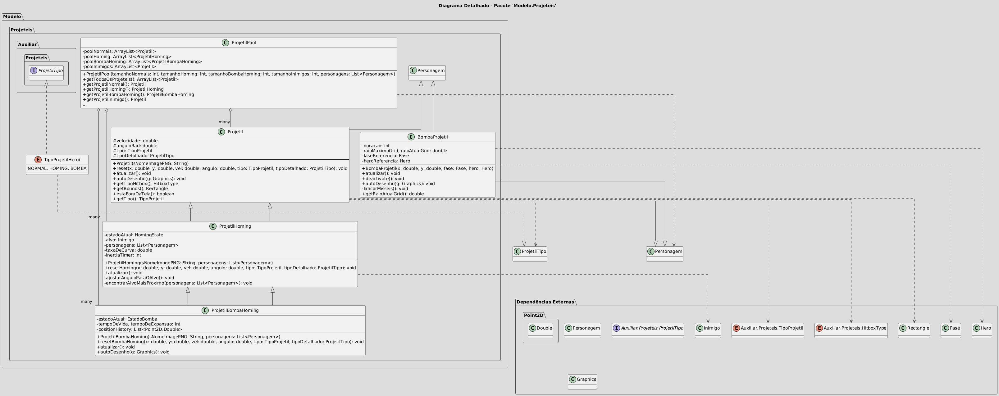

# Phantom

Phantom is a 2D shoot 'em up game, inspired by the Touhou Project series, developed for the Object-Oriented Programming course (SCC0604) at ICMC-USP.

## Gameplay

Navigate through 5 challenging stages, defeating waves of enemies and dodging intricate bullet patterns. The player controls a powerful hero with the ability to move freely, shoot projectiles, and unleash devastating bombs. Collect power-ups to enhance your abilities and score points to achieve a high score.

## Documentation

A detailed documentation of the project's architecture, packages, and classes can be found in the [DOCUMENTACAO.md](DOCUMENTACAO.md) file.

## Assets

Here are some examples of the game's assets:

**Hero:**


**Enemies:**


**Items:**


**Projectiles:**





## Features

*   **5 Unique Stages:** Progress through 5 different stages, each with its own script for enemy and scenery generation.
*   **Dynamic Player Character:**
    *   Precise movement with a "focus" mode (holding Shift) for slower, more accurate dodging.
    *   A power-up system that increases shot power and adds homing missiles.
    *   A bomb system that clears bullets in a large radius and deals massive damage.
*   **Complex Enemies:** A variety of enemies with different movement and attack patterns.
*   **Object Pooling:** An efficient object pool system for projectiles to minimize garbage collection and improve performance.
*   **Data-Driven Design:** Projectile properties (sprites, hitboxes, etc.) are loaded from an external JSON file, allowing for easy modification and expansion.
*   **Advanced Collision Detection:** A Quadtree data structure is used to optimize collision detection, ensuring smooth gameplay even with many objects on screen.
*   **Save/Load System:** Save your progress at any time and load it later to continue your run.
*   **Debug Mode:** A built-in debug mode that displays an FPS counter, player stats, and allows for dynamic enemy spawning via drag-and-drop for testing purposes.

## Project Structure and Implementation Details

The project follows a Model-View-Controller (MVC) architecture to separate concerns:

*   **Model:** Contains the game's data and core logic.
    *   `Personagem`: Abstract base class for all game entities.
    *   `Hero`, `Inimigo`, `Item`, `Projetil`: Concrete implementations of game entities.
    *   `Fase` and `ScriptDeFase`: A flexible system where each `Fase` object is controlled by a `ScriptDeFase` implementation, allowing for unique level design and event scripting for each stage.
*   **View:**
    *   `Cenario`: A `JPanel` responsible for rendering all game objects, backgrounds, and UI elements.
*   **Controller:**
    *   `Engine`: The core of the game, containing the main game loop, state machine (managing states like `JOGANDO`, `RESPAWNANDO`, `GAME_OVER`), and coordinating all other components.
    *   `ControladorDoHeroi`: Translates keyboard input into actions for the `Hero`.
    *   `ControleDeJogo`: Manages game rules, interactions, and collision detection logic.

## How to Run

### Using NetBeans

1.  Open the project in Apache NetBeans.
2.  Press `F6` to build and run the project.

### Using Command Line with Ant

1.  Make sure you have Apache Ant installed.
2.  Navigate to the project's root directory in your terminal.
3.  Run the following command:

    ```bash
    ant run
    ```

## Controls

*   **Movement:** W, A, S, D
*   **Shoot:** K
*   **Bomb:** L
*   **Focus Mode:** Hold Shift
*   **Save Game:** P
*   **Load Game:** R

## Technologies

*   Java
*   Swing (for the GUI)
*   Apache Ant (for building)

### Diagramas UML Detalhados

Para uma compreensão aprofundada da estrutura de cada pacote, os seguintes diagramas UML detalhados foram gerados e podem ser visualizados diretamente aqui:

#### Pacote Controler


#### Pacote Auxiliar


#### Pacote Modelo.Cenario


#### Pacote Modelo.Fases


#### Pacote Modelo.Hero


#### Pacote Modelo.Inimigos


#### Pacote Modelo.Items


#### Pacote Modelo.Projeteis
